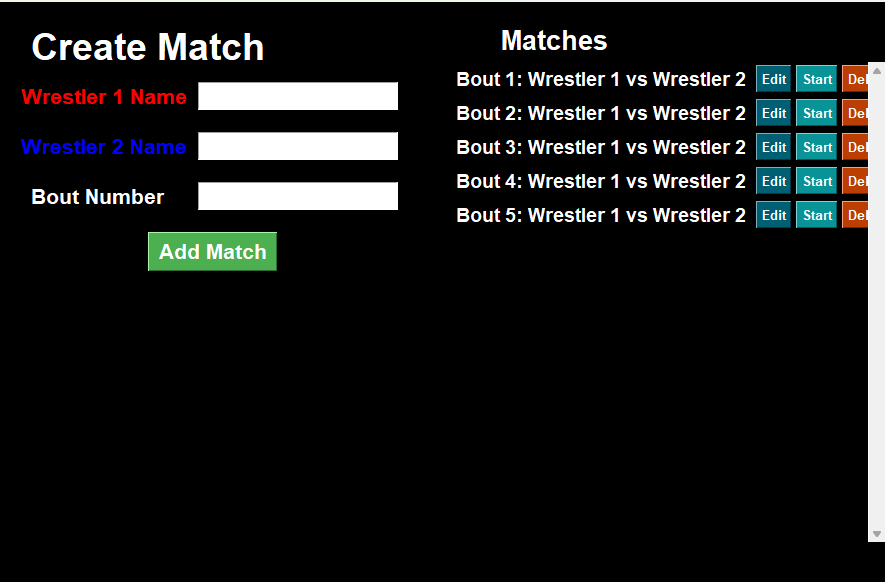
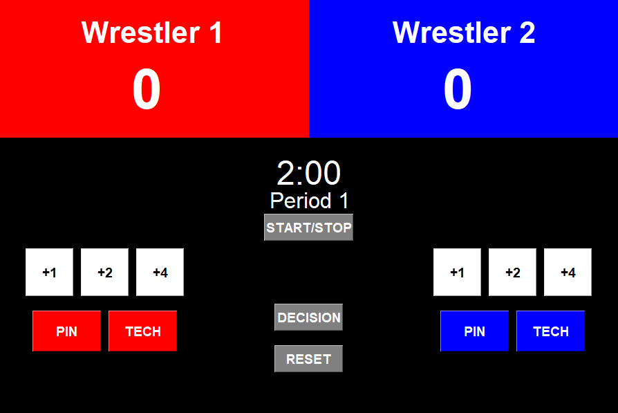
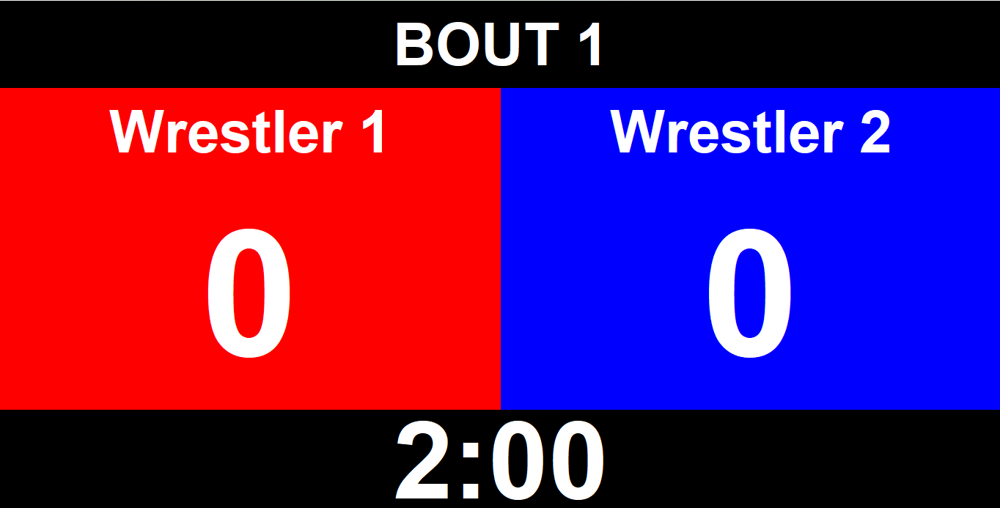

# Wrestling Scoreboard

A **real-time wrestling scoring and timer system** built in **Python (Tkinter)**.
This repository contains the full app code, assets, and setup to run the scoreboard on any system.

---

## Screenshots

Main app view:



Score Editor view:



Scoreboard view:



---

## Features

* Input wrestler names and bout number
* Real-time scoring (1, 2, or 4 point buttons)
* Match timer with automatic **periods & breaks**
* Support for **PIN**, **TECH FALL**, and **DECISION** results
* Undo last scoring action (Backspace key)
* **Keyboard shortcuts**:

  * `Space` → Start/Stop timer
  * `Backspace` → Undo last score
* Fullscreen **Scoreboard View** for projecting on a second monitor
* Reset and restart new bouts quickly

---

## Programs Used

* **Python 3**
* **Tkinter** (GUI framework)
* **screeninfo** (for multi-monitor scoreboard display)

---

## Getting Started

### Prerequisites

* Python 3.8+
* Install dependencies:

```bash
pip install -r requirements.txt
```

### Run the App

```bash
python wrestling_scoreboard.py
```

---

## Roadmap / Future Ideas

* Add decision winner logic
* Save match history to CSV/JSON
* Add weight class tracking
* Mobile/tablet-friendly version
* Tournament bracket mode

---

## License

This project is licensed under the **MIT License** — feel free to use and adapt.

---

## Acknowledgements

* Built by a wrestler, for wrestlers
* Inspired by the need for an **affordable, accessible scoreboard** solution.
